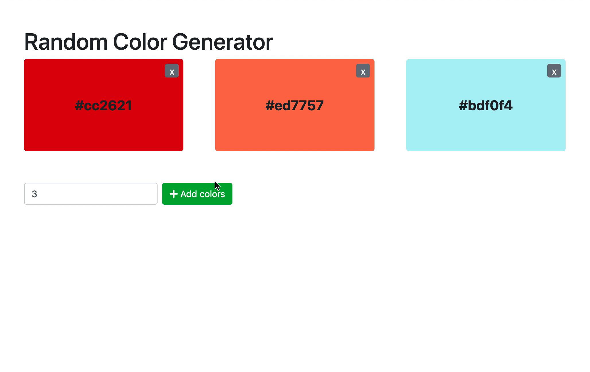

# React + Vite

This template provides a minimal setup to get React working in Vite with HMR and some ESLint rules.

Currently, two official plugins are available:

- [@vitejs/plugin-react](https://github.com/vitejs/vite-plugin-react/blob/main/packages/plugin-react/README.md) uses [Babel](https://babeljs.io/) for Fast Refresh
- [@vitejs/plugin-react-swc](https://github.com/vitejs/vite-plugin-react-swc) uses [SWC](https://swc.rs/) for Fast Refresh

//  In gute Spanish

## Instrucciones para los estudiantes:

### Generador de colores aleatorios (Random Color Generator)

Crea una página web generadora de colores. La página debe generar un cierto número de colores al azar. 
 1. Crear una función para generar un código HEX de color aleatorio
 2. Crear una función para añadir un nuevo elemento de color a la lista, pasando el código de color como argumento
 3. Crear una función para manejar la eliminación de un elemento.
 4. Crear una función para manejar el envío del formulario para añadir más colores, que genere la cantidad necesaria de colores hexadecimales aleatorios y los añada a la lista.
 5. Registra los eventos (click delete y click submit) y adjunta las funciones anteriores.
 6. Crea una función init() que sea llamada al cargar y genere 3 elementos de color

Ejemplo una vez que su programa se ejecuta correctamente:

 
 

### Reglas

- Esta es una tarea individual.
- Plazo: 2 horas.
////////////////////////////////////////////////////////////////////////////////////////////////////////////////////////////////////////////

## Instructions for students:

### Random Color Generator

Create a color generator webpage. The page should generate a certain number of random color. 
 1. Create a function to generate a random color HEX code
 2. Create a function to add a new color item to the list, passing the color code as argument
 3. Create a function to handle the removing of an item.
 4. Create a function to handle the submit of the form for adding more colors, which generates the needed amount of random hex colors and adds them to the list.
 5. Register the events (click delete and click submit) and attach the functions above.
 6. Create a function init() that is called on load and generates 3 color elements

  
 

Example once your program is running properly:

 
 

### Rules

-   This is an individual assignment.
-   Deadline: 2 hours.
